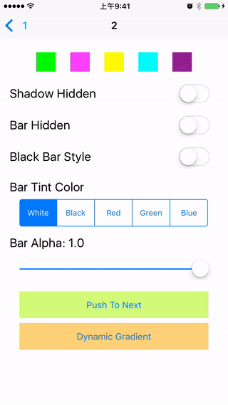
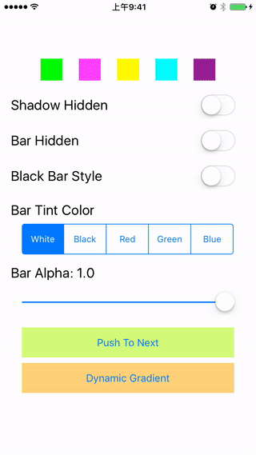
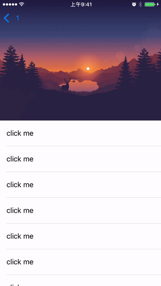
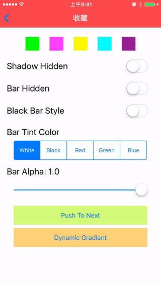
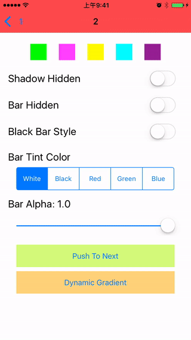

# KxSwiftNavigation
KxSwiftNavigation

效果参考 [HBDNavigationBar](https://github.com/listenzz/HBDNavigationBar.git)

支持Swift5.0+

导航栏的平滑过渡，可以划分为以下情况

### 我们来看微信是如何平滑切换导航栏的状态的


### 阴影显示与隐藏



### 导航栏有与无



### 导航栏背景透明度随 UIScrollView 滚动变化



### 控制器拥有不同的导航栏背景



### 透明度



## 安装:
```ruby
pod 'KxSwiftNavigation'
```

## 使用示例如下,采用前缀navigation.xxx的方式设置相关属性
```swift

navigation.barStyle = .black
navigation.barTintColor = .random
navigation.tintColor = .white
navigation.titleTextAttributes = [NSAttributedString.Key.font: UIFont.systemFont(ofSize: 17),
                                  NSAttributedString.Key.foregroundColor: UIColor.white]
```
